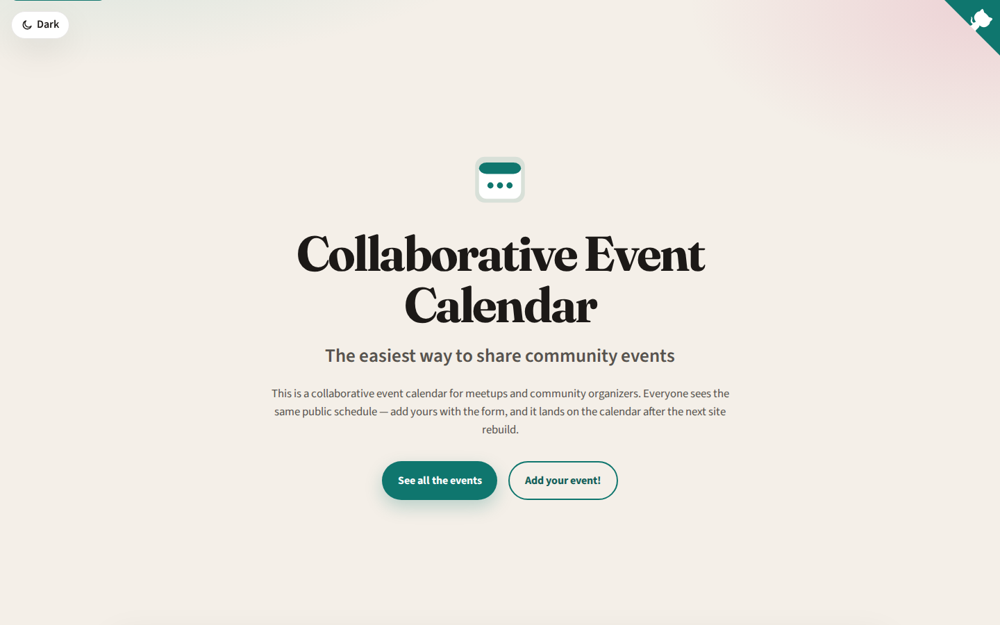
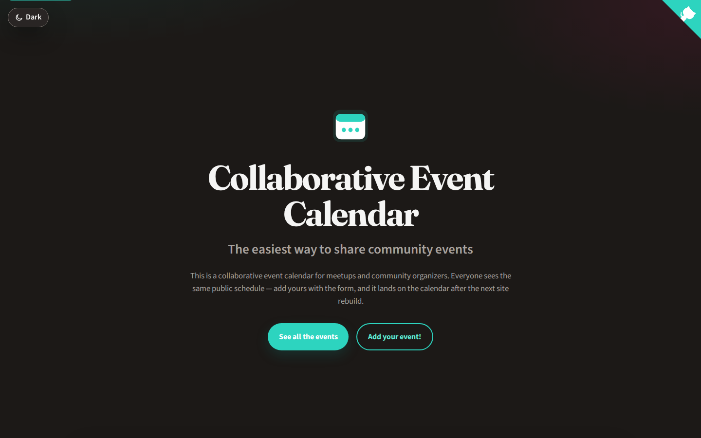
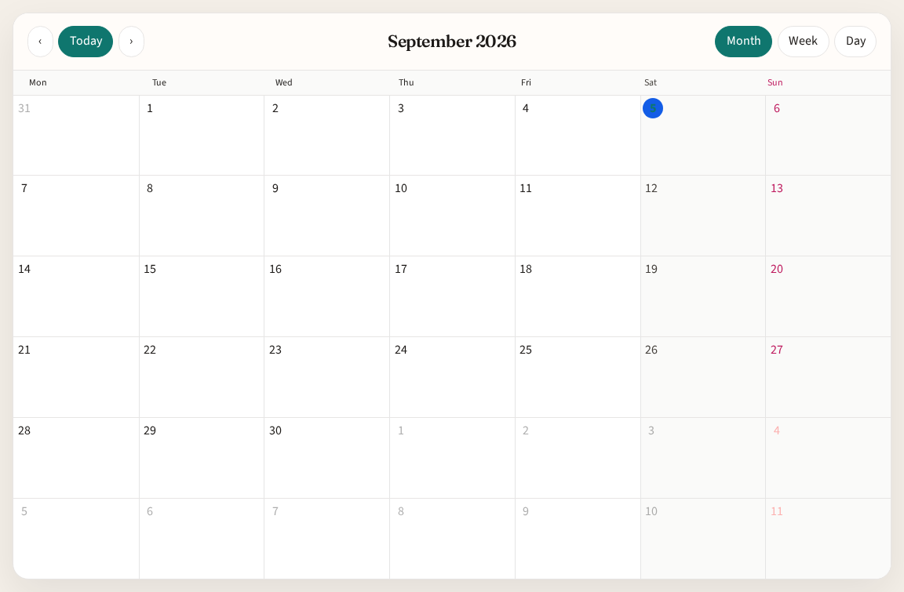
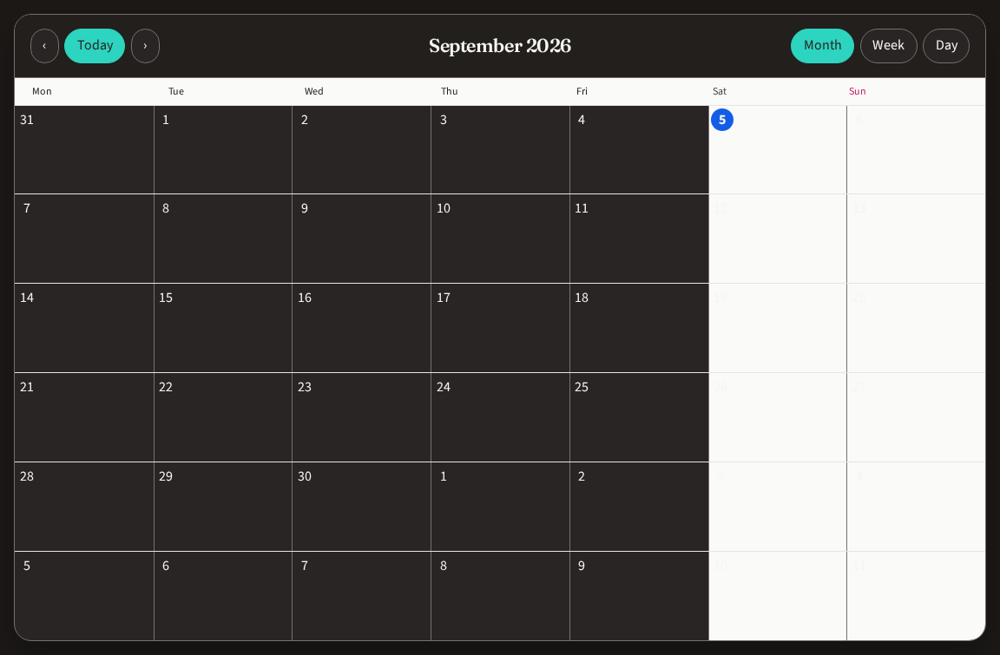

# Astro Collaborative Calendar Theme

A public event calendar for meetups and organizers. People add events through a Google Form, answers land in a Google Spreadsheet, and the site reads those rows at build time.

This is the maintained remake of [gatsby-starter-event-calendar](https://github.com/EmaSuriano/gatsby-starter-event-calendar) (archived). Same Form + Sheet idea, with [Astro](https://astro.build), [TOAST UI Calendar](https://ui.toast.com/tui-calendar) v2, and GitHub Pages. No Gatsby, no Grommet, no GCP service account.

## Live site

https://emasuriano.github.io/astro-collaborative-calendar-theme/

Subscribe in Google/Apple Calendar: [events.ics](https://emasuriano.github.io/astro-collaborative-calendar-theme/events.ics)

## Screenshots 📸

Captured from the [live site](https://emasuriano.github.io/astro-collaborative-calendar-theme/) with [shot-scraper](https://github.com/simonw/shot-scraper) via [`shots.yml`](shots.yml) (workflow: [`.github/workflows/screenshots.yml`](.github/workflows/screenshots.yml)). Light and dark for Home and Calendar.

| Light | Dark |
| ----- | ---- |
|  |  |
|  |  |

## Features

- Month calendar by default, with week and day views (TOAST UI Calendar)
- Event detail popup (name, date, time, place, link)
- Add your event via Google Form
- Optional Time column: timed events last 90 minutes; blank time stays all-day
- Past events stay on the calendar; far-future junk is capped
- Dark theme with a toggle (follows system preference, then remembers the choice)
- ICS subscribe feed
- Build-time Google Sheets CSV fetch, with sample events as fallback
- GitHub Pages on push to main, manual dispatch, a 6-hour cron, and an optional rebuild on form submit
- CI on pull requests (astro check + astro build)
- Config in src/config.ts

## How events get onto the calendar

1. Someone submits the Google Form (`formLink`).
2. Answers are stored in a Google Spreadsheet (`spreadsheetLink`).
3. `astro build` fetches the sheet as CSV and maps rows to calendar events.
4. GitHub Actions rebuilds Pages on push to `main`, every 6 hours, and (if you wire it up) on each form submit.

No `googleapis` client and no service-account JSON. Publish the sheet to the web so the CSV is public. If the fetch fails, the build logs a warning and falls back to `src/data/events.ts`.

## Set up your own Form + Spreadsheet

The original write-up is [Building a collaborative calendar with Google and Gatsby](https://emasuriano.com/blog/building-a-collaborative-calendar-with-google-and-gatsby). The flow is the same; this theme uses **Publish to the web** instead of a service account.

1. Create a Google Form ([forms.new](https://forms.new)) with questions for name, when, time, where, and a link.
2. Send responses to a spreadsheet (Responses tab, green Sheets icon).
3. Make the sheet readable at build time: share with anyone who has the link, then File, Share, Publish to the web. Until that is done, CSV URLs return 401 and the site shows sample events.
4. Point the theme at your form and sheet in `src/config.ts`: `formLink`, `spreadsheetLink`, `sheetColumns`, and `spreadsheetCsvUrl` (the pubhtml or pub?output=csv link).
5. Deploy by pushing to `main`, or run the Deploy to GitHub Pages workflow.

The loader tries `spreadsheetCsvUrl` first (`/pubhtml` becomes `pub?output=csv`), then published `/d/e/{id}/pub?output=csv`, then the spreadsheet export and gviz CSV URLs.

Header matching is case-insensitive and ignores punctuation, spaces, underscores, and emoji. A Timestamp column is ignored. Rows missing a name or date are skipped.

### Rebuild as soon as someone submits

The 6-hour cron is a safety net. To rebuild on each form answer, follow [docs/rebuild-on-form-submit.md](docs/rebuild-on-form-submit.md).

## Local development

Requires Node 22.12 or newer. Scripts live in package.json: dev, check, build, preview. The site base is /astro-collaborative-calendar-theme so assets work on GitHub project pages.

## Events

Each event: id, eventName, date, eventLink, place, optional time.

date can be ISO 8601, MM/dd/yyyy, M/D/YYYY, or a Sheets datetime. time is the Google Forms time question. Timed events last 90 minutes by default. The ICS feed uses the same event window as the homepage.

## Deploy and CI

Deploy workflow: push to main, workflow_dispatch, cron every 6 hours, repository_dispatch type rebuild-site.

CI workflow: pull requests and push to main run astro check and astro build.

Live URL: https://emasuriano.github.io/astro-collaborative-calendar-theme/

## Project structure

src/config.ts, src/data/loadEvents.ts, src/data/events.ts, src/pages/index.astro, src/pages/events.ics.ts, src/components/EventCalendar.astro, src/components/ThemeToggle.astro, src/styles/global.css, .github/workflows/deploy.yml, .github/workflows/ci.yml, docs/rebuild-on-form-submit.md

## Why not the Gatsby starter?

The [gatsby-starter-event-calendar](https://github.com/EmaSuriano/gatsby-starter-event-calendar) repo is archived. This theme is the same product with a smaller stack: Astro instead of a React tree, TOAST UI instead of a custom month grid, published CSV instead of a GCP service account, and GitHub Pages CI/CD built in.
